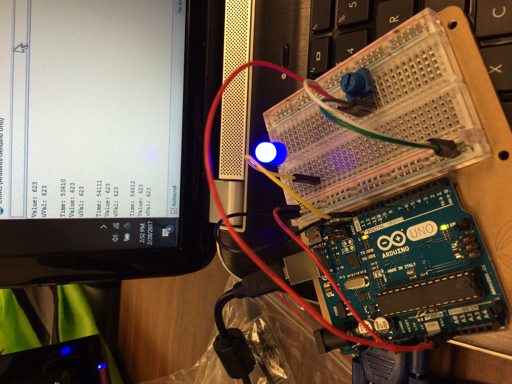

# Simple Analog Reader (sar)
Following [this tutorial](https://www.arduino.cc/en/Tutorial/AnalogInput) to get the hang of doing analog input reads with an Arduino

### Got it working! Woohoo!
Now, on to the next project...

### Resources
[Analog input tutorial](https://www.arduino.cc/en/Tutorial/AnalogInput)
[Potentiometer tutorial](https://www.arduino.cc/en/Tutorial/Potentiometer)

### Media
[Video in action](https://drive.google.com/open?id=0B_RrKIVEXTyBRWNaQ19PWm8tVFE)
